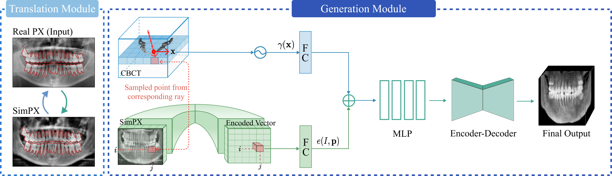

# NeBLa: Neural Beer-Lambert for 3D Reconstruction of Oral Structures from Panoramic Radiographs

 

Welcome to the official code repository for the paper titled "NeBLa: Neural Beer-Lambert for 3D Reconstruction of Oral Structures from Panoramic Radiographs," accepted at AAAI 2024. In this repository, you'll find the core model classes used in the generation module.

## Model Details

The final encoder-decoder model for refinement is a 3D-UNet model, and the corresponding code can be found at [pytorch-3dunet](https://github.com/wolny/pytorch-3dunet).

A significant portion of the MLP model and point embedder is adapted from the code available at [nerf-pytorch](https://github.com/yenchenlin/nerf-pytorch).

For the translation module, the code is based on the CycleGAN model, and you can refer to [pytorch-CycleGAN-and-pix2pix](https://github.com/junyanz/pytorch-CycleGAN-and-pix2pix).

Feel free to explore and adapt the code to suit your needs.
